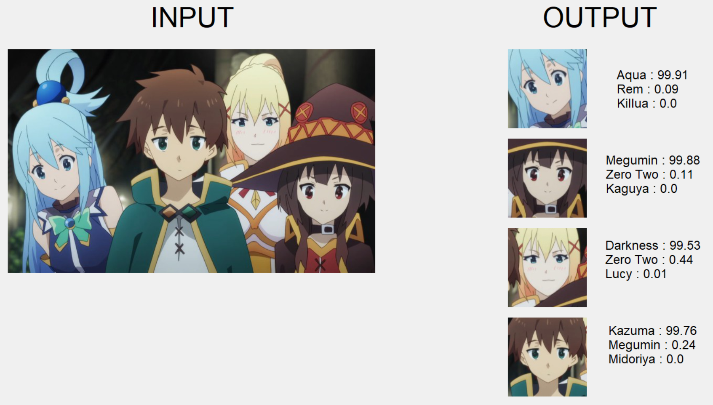
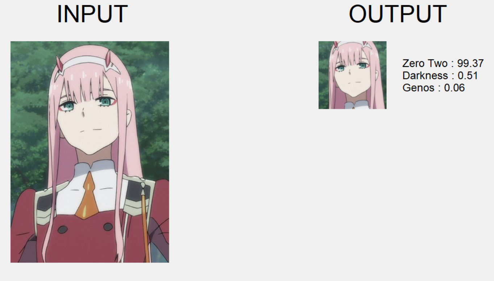
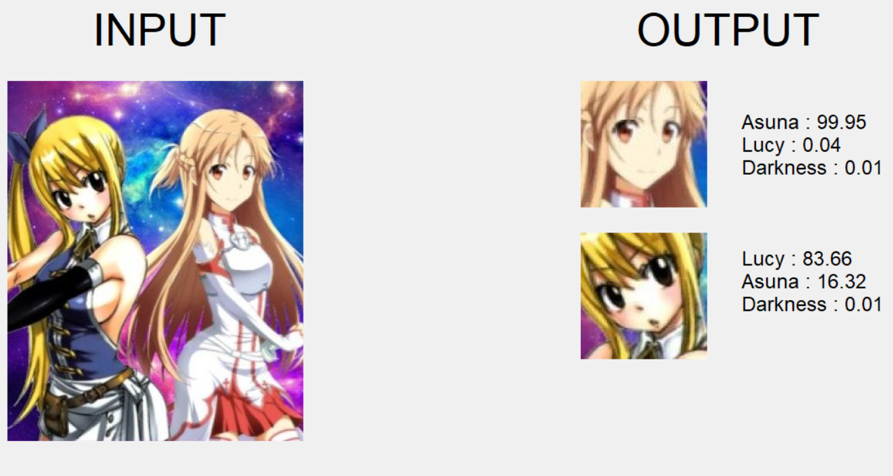
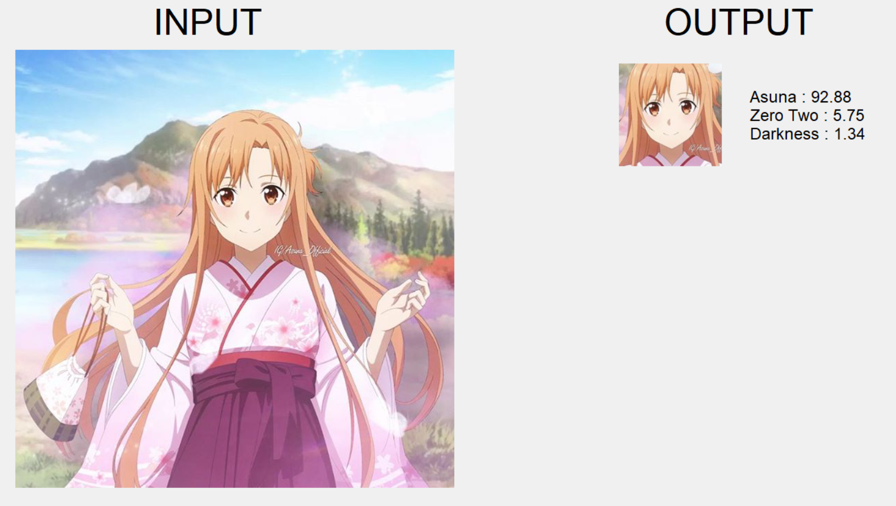
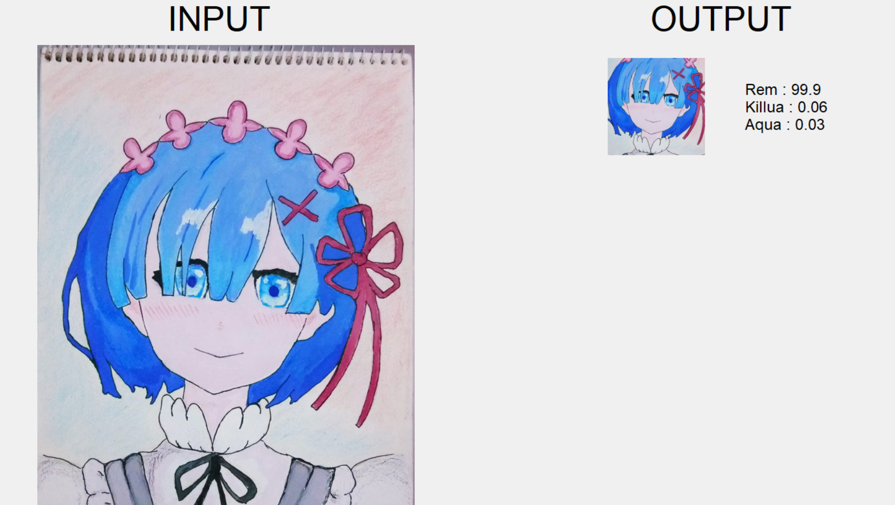

# Anime Character Recognition

## Introduction
The aim of this project is to create an image classifier for animated characters. As animation differs vastly due to different art styles, so here I have chosen the most popular ones amongst them - the Japanese anime characters.
For starters I have taken 16 characters (1,280 images) but it can be easily expanded for many more in future.

### Working
The approach I used for face recognition is fairly straight forward. The key here is to get a deep neural network to produce a bunch of numbers that describe a face (known as face encodings). When you pass in two different images of the same character, the network should return similar outputs (i.e. closer numbers) for both images, whereas when you pass in images of two different characters, the network should return very different outputs for the two images. This means that the neural network needs to be trained to automatically identify different features of faces and calculate numbers based on that. The output of the neural network can be thought of as an identifier for a particular character’s face — if you pass in different images of the same person, the output of the neural network will be very similar/close, whereas if you pass in images of a different character, the output will be very different.

This project only uses 80 images per character for learning, which is a very low number for image recognition learning. However, this number is chosen since the majority of characters have a limited number of arts. 
•	Utilize lbpcascade_animeface to recognize character face from each image 
•	Resize each image to 150 x 150 pixels 
•	Split images into training & validation before creating the final model

## Demo

## Detailed Project Report

a:link, a:visited {
  background-color: #f44336;
  color: white;
  padding: 14px 25px;
  text-align: center;
  text-decoration: none;
  display: inline-block;
}

a:hover, a:active {
  background-color: red;
}

<a href="https://hachiman20.github.io/Project%20Report.pdf" class="image fit">Project Report</a>
